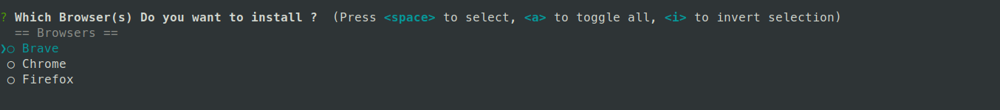
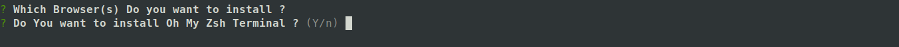
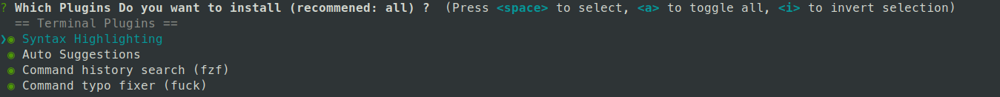
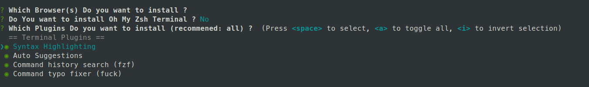

### This project is created for those who want to setup their machines with below softwares.

<h3>
   <ol>
      <li> Visual Studio Code </li>
      <li> Zsh (Oh my zsh) </li>
      <li> Auto completion </li>
      <li> fuck </li>
      <li> git </li>
      <li> zsh z </li>
      <li> sudo </li>
      <li> powerlevel10k </li>
      <li> alias </li>
      <li> terminal customization </li>

      - battery indicator
      - programming language used in current dir
      - OS installed
      - last command status
      - git branch
      - git status
      - directory path
   </ol>
</h3>

<h2>Installation</h2>

<h4> 

+ clone project 
+ npm install 
+ npm start
</h4>
